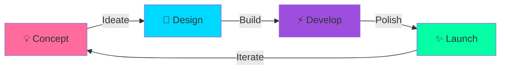

# 🌌 ADROIT — Innovation Beyond Boundaries

<div align="center">

### *"Where imagination becomes interface"*

[](https://github.com/adroit)
[](https://github.com/adroit)
[](https://github.com/adroit)
[](https://github.com/adroit)

</div>

---

## 🎯 Who We Are

**ADROIT** is a student-driven innovation collective pushing the boundaries of technology, creativity, and imagination. We're builders, dreamers, and problem-solvers who believe that the future is shaped by those bold enough to create it.

<div align="center">

*"Innovation distinguishes between a leader and a follower." — Steve Jobs*

</div>

---

## 🚀 Our Domains

<div align="center">


</div>

<table>
<tr>
<td width="50%">

### 🤖 Machine Learning
Predictive models, neural networks, and AI that thinks beyond the obvious.

</td>
<td width="50%">

### 📊 Data Analytics
Transforming raw data into actionable insights and beautiful visualizations.

</td>
</tr>
<tr>
<td width="50%">

### 🔐 Cybersecurity
Protecting digital frontiers and exploring ethical hacking territories.

</td>
<td width="50%">

### ☁️ Cloud Computing
Building scalable architectures that live beyond single machines.

</td>
</tr>
</table>

---

## 🌟 Our Journey



<div align="center">

### 🌑 Phase 1 — Genesis
*Concept birth and structural mapping*

### ☄️ Phase 2 — Formation
*Designs, animations, and visuals take shape*

### 🌕 Phase 3 — Building
*Pages, components, and modules materialize*

### 🌟 Phase 4 — Polish
*Perfection through iteration and refinement*

### 🌈 Phase 5 — Launch
*Deployment and real-world impact*

</div>

---

## 💫 Why Join ADROIT?

- 🎓 **Learn from peers** — Collaborative workshops and hackathons
- 🛠️ **Build real projects** — Not just tutorials, actual products that matter
- 🤝 **Network actively** — Connect with industry professionals and alumni
- 🏆 **Compete & win** — Participate in competitions with team support
- 🎨 **Express creatively** — Blend tech with art, music, and design
- 📈 **Grow exponentially** — From beginner to builder to leader

<div align="center">

*"The best way to predict the future is to create it." — Peter Drucker*

</div>

---

## 🎯 What We Do

```
┌─────────────────────────────────────────────┐
│  📅 Workshops & Tech Talks                  │
│  💻 Hackathons & Coding Competitions        │
│  🎤 Guest Lectures from Industry Experts    │
│  🚀 Project Showcases & Demo Days           │
│  🎮 Game Nights & Team Building             │
│  📚 Resource Sharing & Mentorship           │
│  🌍 Open Source Contributions               │
└─────────────────────────────────────────────┘
```

---

## 🔥 Featured Projects

| Project | Description | Tech Stack |
|---------|-------------|-----------|
| 🤖 **AI Chatbot** | Intelligent conversation agent with NLP | Python, TensorFlow, Flask |
| 📊 **Data Viz Dashboard** | Real-time analytics platform | React, D3.js, Node.js |
| 🔐 **SecureVault** | Encrypted password manager | Rust, SQLite, Electron |
| 🎮 **GameHub** | Multiplayer game platform | Unity, C#, WebSockets |
| 🌐 **PortfolioGen** | Automated portfolio generator | Next.js, Tailwind, MDX |

---

## 📬 Join the Movement

<div align="center">

**Ready to turn ideas into reality?**

[](https://www.instagram.com/adroit_rnsit)
[]( https://www.linkedin.com/company/adroit-rnsit
)
[](mailto:adroit.rnsit@gmail.com)

</div>

---

<div align="center">

### ⚡ *"If you can imagine it — you can create it"* ⚡

---

### 🌟 Star this repo if ADROIT sparked your imagination! 🌟


---

**Made with 💜 by the ADROIT Community**

*Darkness is not the absence of light — it is the presence of control.*

</div>
