# 🌌 ADROIT
### Innovation Beyond Boundaries

 

## 🎯 About Us

ADROIT is a **student-driven innovation collective** pushing the boundaries of technology, creativity, and imagination. We're builders, dreamers, and problem-solvers who believe that the future is shaped by those bold enough to create it.

 

## 🚀 Our Domains

<table>
<tr>
<td align="center" width="25%">
 
<b>Machine Learning</b> 
Teaching machines to think
</td>
<td align="center" width="25%">
 
<b>Data Analytics</b> 
Turning data into decisions
</td>
<td align="center" width="25%">
 
<b>Cybersecurity</b> 
Defending digital frontiers
</td>
<td align="center" width="25%">
 
<b>Cloud Computing</b> 
Building infrastructure at scale
</td>
</tr>
</table>

 

## 🌟 Development Pipeline

```mermaid
graph LR
    A[💡 Ideate] --> B[🎨 Design]
    B --> C[⚙️ Develop]
    C --> D[🧪 Test]
    D --> E[🚀 Deploy]
    E --> A
    style A fill:#FF6B9D,stroke:#fff,stroke-width:2px,color:#fff
    style B fill:#00D9FF,stroke:#fff,stroke-width:2px,color:#fff
    style C fill:#9D4EDD,stroke:#fff,stroke-width:2px,color:#fff
    style D fill:#06FFA5,stroke:#fff,stroke-width:2px,color:#000
    style E fill:#FFD700,stroke:#fff,stroke-width:2px,color:#000
```

 

## 💫 Why Join ADROIT?

<table>
<tr>
<td width="50%" valign="top">

### 🎓 Learn & Grow
Collaborative workshops, hackathons, and hands-on projects that accelerate your learning curve.

### 🛠️ Build Real Products
Work on actual products that solve real problems, not just tutorial projects.

### 🏆 Compete & Win
Participate in hackathons and competitions with full team support and mentorship.

</td>
<td width="50%" valign="top">

### 🤝 Network Actively
Connect with industry professionals, alumni, and fellow passionate developers.

### 🎨 Express Creativity
Blend technology with art, design, and innovation to create unique solutions.

### 📈 Career Growth
From beginner to builder to leader — grow your technical and leadership skills.

</td>
</tr>
</table>

 

## 🎯 What We Do

| Activity | Description |
|:--------:|:------------|
| 📅 | **Weekly Workshops** — Deep dives into cutting-edge technologies |
| 💻 | **Hackathons** — 24-48 hour intense building sprints |
| 🎤 | **Tech Talks** — Industry experts share real-world insights |
| 🚀 | **Demo Days** — Showcase your projects to the community |
| 🎮 | **Tech Socials** — Gaming nights, team building, and networking |
| 📚 | **Mentorship** — One-on-one guidance from seniors and alumni |
| 🌍 | **Open Source** — Contribute to projects that matter globally |

 

## 🔥 Featured Projects

| Project | Description | Stack |
|:-------:|:-----------|:------|
| 🤖 | **AI Chatbot** — Intelligent NLP conversation agent | `Python` `TensorFlow` `Flask` |
| 📊 | **Data Dashboard** — Real-time analytics platform | `React` `D3.js` `Node.js` |
| 🔐 | **SecureVault** — Encrypted password manager | `Rust` `SQLite` `Electron` |
| 🎮 | **GameHub** — Multiplayer gaming platform | `Unity` `C#` `WebSockets` |

 

## 📬 Connect With Us

 

## ⚡ Daily Inspiration

---

### 🌟 Star this repo to support ADROIT! 🌟

 

**Made with 💜 by the ADROIT Community**

*"If you can imagine it — you can create it"*

 

